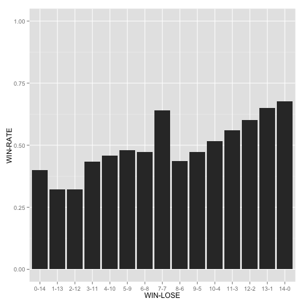

勝ち負け同数で迎えた千秋楽の勝敗分布
===

## はじめに

大相撲で, 7勝7敗で迎えた最終日の勝敗をチェックします. 

勝率50％に近いほうがいい気がしますよね. 

相撲の取り組みの決め方が不明, というのが難点ですが, もし偏りがあれば怪しい気がします. 知りませんけど. 

7勝7敗出迎えた最終日に, 調子の悪い相手を当ててあげる習慣などがあるかもしれません. 

## 扱うデータ

昭和2年初場所から, 平成26年9月場所の幕内(十両以上?)の取り組み結果データを利用します. 

データは, [大相撲星取表](http://gans01.fc2web.com)さんのWebサイトから作っています. 


## 力士別に勝敗列データを抽出

使うデータの中身です.  

```r
dat = fread("../winLoseDataTable.dat", header=FALSE)
dat_winlose = 
  dat %>% select(V1,V2,V3,V6) %>% 
  mutate(win_flg = ifelse(V6 == "W", 1, 0)) %>% 
  mutate(lose_flg = ifelse(V6 == "L", 1, 0))  %>% 
  select(V1, V2, V3, win_flg, lose_flg) %>% 
  setnames(c("TOURNAMENT","CLASS", "NAME", "WIN_FLG", "LOSE_FLG"))

dat_winlose %>% head
```

```
##    TOURNAMENT CLASS       NAME WIN_FLG LOSE_FLG
## 1:       H1-1  横綱 千代の富士       1        0
## 2:       H1-1  横綱 千代の富士       1        0
## 3:       H1-1  横綱 千代の富士       1        0
## 4:       H1-1  横綱 千代の富士       1        0
## 5:       H1-1  横綱 千代の富士       1        0
## 6:       H1-1  横綱 千代の富士       1        0
```

## 内容確認: 全勝優勝力士

データの内容確認のために, とりあえず全勝優勝回数をまとめてみます.  


```r
dat_allwin = 
  dat_winlose %>% 
  group_by(TOURNAMENT, CLASS,NAME) %>% 
  summarise_each(funs(sum)) %>% 
  group_by(add=FALSE) %>% 
  arrange(desc(WIN_FLG)) %>% 
  filter(WIN_FLG==15)
dat_allwin %>% head(20)
```

```
##    TOURNAMENT  CLASS       NAME WIN_FLG LOSE_FLG
## 1        H1-9   横綱 千代の富士      15        0
## 2       H16-1   横綱     朝青龍      15        0
## 3       H16-3   横綱     朝青龍      15        0
## 4       H17-1   横綱     朝青龍      15        0
## 5       H17-5   横綱     朝青龍      15        0
## 6      H18-11   横綱     朝青龍      15        0
## 7       H18-3 十両11     把瑠都      15        0
## 8       H19-5   大関       白鵬      15        0
## 9       H20-7   横綱       白鵬      15        0
## 10     H21-11   横綱       白鵬      15        0
## 11      H21-3   横綱       白鵬      15        0
## 12      H22-3   横綱       白鵬      15        0
## 13      H22-5   横綱       白鵬      15        0
## 14      H22-7   横綱       白鵬      15        0
## 15      H22-9   横綱       白鵬      15        0
## 16      H24-7   大関   日馬富士      15        0
## 17      H24-9   大関   日馬富士      15        0
## 18      H25-1   横綱   日馬富士      15        0
## 19      H25-3   横綱       白鵬      15        0
## 20      H25-5   横綱       白鵬      15        0
```

白鳳が凄いです. 全勝優勝回数ランキングを作ります. 

```r
dat_allwin %>% 
  group_by(NAME) %>% 
  summarise(COUNT = n()) %>% 
  arrange(desc(COUNT))
```

```
## Source: local data table [32 x 2]
## 
##          NAME COUNT
## 1        白鵬    10
## 2        大鵬     8
## 3  千代の富士     7
## 4      北の湖     6
## 5      朝青龍     5
## 6    北の富士     3
## 7      双葉山     3
## 8    日馬富士     3
## 9      貴乃花     3
## 10       輪島     3
## 11     若乃花     2
## 12     隆の里     2
## 13   三重ノ海     1
## 14       内田     1
## 15   北の冨士     1
## 16   千代の山     1
## 17     吉葉山     1
## 18     大乃国     1
## 19       岩下     1
## 20     把瑠都     1
## 21     時津山     1
## 22       柏戸     1
## 23     栃ノ心     1
## 24       栃光     1
## 25       栃錦     1
## 26     武蔵丸     1
## 27       照國     1
## 28     玉の海     1
## 29     玉乃海     1
## 30     羽黒山     1
## 31     若嶋津     1
## 32     貴ノ花     1
```

貴乃花と貴ノ花で別に分けて集計されていますね. 

名寄せが必要ですが, 面倒なのでやりません. 今回の集計には影響しませんし. 

## 本題: 勝ち負け同数で迎えた最終日

大会別に力士別勝敗集計結果と, 最終日の結果を見てみます. 

最終結果が8勝7敗で最終日に勝っている人が有意に(?)多かったら, 怪しいですね. 

まずは, 大会別勝敗. 

```r
## 勝敗結果集計
dat_winlose_tournament = 
  dat_winlose %>% 
  group_by(TOURNAMENT,CLASS,NAME) %>% 
  summarise_each(funs(sum))
head(dat_winlose_tournament)
```

```
##   TOURNAMENT  CLASS     NAME WIN_FLG LOSE_FLG
## 1       H1-1  前頭1 安芸ノ島       7        8
## 2       H1-1  前頭1     寺尾       8        7
## 3       H1-1 前頭10     板井       8        7
## 4       H1-1 前頭10   琴富士       6        9
## 5       H1-1 前頭11 栃乃和歌       7        8
## 6       H1-1 前頭12   旭道山       9        6
```

次に, 15日目の勝敗. 

```r
## 日付を載せる
dat_winlose_day = 
  dat_winlose %>% 
  group_by(TOURNAMENT, CLASS,NAME) %>% 
  mutate(DAY = 1:length(WIN_FLG))  

## 最終日の結果
dat_lastday_win = 
  dat_winlose_day %>% 
  filter(DAY==15) %>%
  mutate(LASTDAY_WIN_FLG = ifelse(WIN_FLG == 1, 1, 0)) %>% 
  select(TOURNAMENT:NAME,LASTDAY_WIN_FLG)
head(dat_lastday_win)
```

```
##   TOURNAMENT  CLASS     NAME LASTDAY_WIN_FLG
## 1       H1-1  前頭1 安芸ノ島               1
## 2       H1-1  前頭1     寺尾               1
## 3       H1-1 前頭10     板井               0
## 4       H1-1 前頭10   琴富士               0
## 5       H1-1 前頭11 栃乃和歌               0
## 6       H1-1 前頭12   旭道山               0
```

2つをマージして, 7勝7敗で千秋楽を迎えた人たちの結果を見てみます. 

```r
## 大会別勝敗と最終日成績
dat_winlose_tournament_lastday = 
  merge(dat_winlose_tournament, dat_lastday_win, by = c("TOURNAMENT","CLASS","NAME"))  

## 8勝7敗で最後に勝った人 
num_8_7_last_win = 
  dat_winlose_tournament_lastday %>% 
  filter(WIN_FLG==8 & LOSE_FLG==7 & LASTDAY_WIN_FLG == 1) %>% 
  group_by(WIN_FLG,LOSE_FLG, LASTDAY_WIN_FLG) %>% 
  summarise(NUM = n())

## 8勝7敗で最後に勝った人 
num_8_7_last_win 
```

```
## Source: local data table [1 x 4]
## Groups: WIN_FLG, LOSE_FLG
## 
##   WIN_FLG LOSE_FLG LASTDAY_WIN_FLG  NUM
## 1       8        7               1 2730
```

```r
## 7勝8敗で最後に負けた人
num_7_8_last_lose = 
  dat_winlose_tournament_lastday %>% 
  filter(WIN_FLG==7 & LOSE_FLG==8 & LASTDAY_WIN_FLG == 0) %>% 
  group_by(WIN_FLG,LOSE_FLG, LASTDAY_WIN_FLG) %>% 
  summarise(NUM = n())

## 7勝8敗で最後に負けた人
num_7_8_last_lose 
```

```
## Source: local data table [1 x 4]
## Groups: WIN_FLG, LOSE_FLG
## 
##   WIN_FLG LOSE_FLG LASTDAY_WIN_FLG  NUM
## 1       7        8               0 1528
```

7勝7敗で迎えた千秋楽.  

勝ってめでたく勝ち越した力士は``2730``人, 

敗けて残念負け越した力士は ``1528`` 人でした. 


## 追加: 勝敗数別に最終日の対戦成績

最終日を迎えたタイミングでの勝敗数別に勝率を計算してみました. 
@ShotaSAITOさんに言われて作ってみました. 
<blockquote class="twitter-tweet" lang="ja"><p><a href="https://twitter.com/gg_hatano">@gg_hatano</a> 0勝14敗から14勝0敗まで調べてみて初めて何か言える気がする。例えば、0勝から14勝まで勝ち越し率が単純に増加傾向にあったら、実はメンタルじゃなくてただ強さの問題だった、とか。</p>&mdash; Shota SAITO (@ShotaSAITO) <a href="https://twitter.com/ShotaSAITO/status/541051934372003840">2014, 12月 6</a></blockquote> <script async src="//platform.twitter.com/widgets.js" charset="utf-8"></script>

```r
library(ggplot2)
dat_winlose_tournament_lastday %>% 
  mutate(WIN_14 = ifelse(LASTDAY_WIN_FLG == 1, WIN_FLG -1, WIN_FLG)) %>% 
  mutate(LOSE_14 = ifelse(LASTDAY_WIN_FLG == 0, LOSE_FLG-1 , LOSE_FLG)) %>%
  select(TOURNAMENT,CLASS,NAME,WIN_14,LOSE_14,LASTDAY_WIN_FLG) %>% 
  group_by(WIN_14,LOSE_14) %>% 
  summarise(NUM = n(), WIN = sum(LASTDAY_WIN_FLG), 
            WIN_RATE = mean(LASTDAY_WIN_FLG)) %>% 
  filter(WIN_14 + LOSE_14 == 14) %>% 
  mutate(WIN_LOSE = paste(WIN_14, LOSE_14, sep="-")) %>% 
  group_by(add=FALSE) %>%
  mutate(ORDER = 1:length(WIN_LOSE)) %>% 
  arrange(ORDER) %>% 
  ggplot(aes(x=reorder(WIN_LOSE, ORDER))) + 
  geom_bar(aes(y=WIN_RATE), stat="identity") + 
  ylim(0,1) + xlab("WIN-LOSE") + ylab("WIN-RATE")
```

 

左端が0勝, 右端が14勝です. 

## 追加: 大関限定

7勝7敗で千秋楽を迎えた大関の勝率. 

```r
library(stringr)
dat_oozeki_7_7 = 
  dat_winlose_tournament_lastday %>% 
  filter(str_detect(CLASS, "大関")) %>% 
  mutate(WIN_14 = ifelse(LASTDAY_WIN_FLG == 1, WIN_FLG -1, WIN_FLG)) %>% 
  mutate(LOSE_14 = ifelse(LASTDAY_WIN_FLG == 0, LOSE_FLG-1 , LOSE_FLG)) %>%
  select(TOURNAMENT,CLASS,NAME,WIN_14,LOSE_14,LASTDAY_WIN_FLG)  %>% 
  filter(WIN_14 == 7 & LOSE_14 == 7) %>% 
  group_by(WIN_14,LOSE_14) %>% 
  summarise(NUM = n(), WIN_RATE = mean(LASTDAY_WIN_FLG))
dat_oozeki_7_7
```

```
## Source: local data table [1 x 4]
## Groups: WIN_14
## 
##   WIN_14 LOSE_14 NUM WIN_RATE
## 1      7       7  86 0.755814
```
7勝7敗で千秋楽を迎えた大関の勝率は``0.755814`` 

普段は, 


```r
dat_oozeki = dat_winlose %>% 
  filter(str_detect(CLASS, "大関")) %>% 
  summarise(NUM = length(WIN_FLG), WIN = sum(WIN_FLG), WIN_RATE = mean(WIN_FLG))
dat_oozeki
```

```
##      NUM   WIN  WIN_RATE
## 1: 19420 12347 0.6357878
```
普段の大関の勝率は``0.6357878`` 


```r
dat_oozeki = dat_winlose %>% 
  filter(str_detect(CLASS, "大関")) %>% write.csv("oozeki.csv", quote=FALSE, row.names=FALSE, col.names=FALSE )
```

```
## Warning in write.csv(., "oozeki.csv", quote = FALSE, row.names = FALSE, :
## attempt to set 'col.names' ignored
```

なんやかんやして...

```r
dat_oozeki_mod = fread("oozeki.csv.tmp")
dat_oozeki_mod_year = 
  dat_oozeki_mod %>% 
  setnames(c("EMP", "EMP_YEAR", "MONTH", "CLASS", "NAME", "WIN_FLG", "LOSE_FLG")) %>% 
  mutate(YEAR = EMP + EMP_YEAR) %>% 
  select(YEAR, MONTH, CLASS, NAME, WIN_FLG,LOSE_FLG)
## 負け越したかどうか
dat_oozeki_makekoshi = 
  dat_oozeki_mod_year %>% 
  group_by(YEAR,MONTH,CLASS,NAME) %>% 
  summarise(WIN = sum(WIN_FLG), LOSE=sum(LOSE_FLG)) %>% 
  mutate(MAKEKOSHI_FLG = (WIN<LOSE)) %>% 
  group_by(add=FALSE) %>% 
  arrange(NAME, YEAR,MONTH) 

dat_oozeki_makekoshi %>% 
  group_by(NAME) %>% 
  mutate(MAEBASYO_MAKEKOSHI_FLG = c(FALSE, head(MAKEKOSHI_FLG, length(MAKEKOSHI_FLG)-1))) %>% 
  select(YEAR,MONTH,NAME,MAEBASYO_MAKEKOSHI_FLG)
```

```
## Source: local data table [1,403 x 4]
## Groups: NAME
## 
##    YEAR MONTH     NAME MAEBASYO_MAKEKOSHI_FLG
## 1  1953     9   三根山                  FALSE
## 2  1954     1   三根山                  FALSE
## 3  1954     3   三根山                  FALSE
## 4  1954     5   三根山                  FALSE
## 5  1954     9   三根山                  FALSE
## 6  1955     1   三根山                   TRUE
## 7  1955     3   三根山                  FALSE
## 8  1955     5   三根山                   TRUE
## 9  1976     1 三重ノ海                  FALSE
## 10 1976     3 三重ノ海                  FALSE
## ..  ...   ...      ...                    ...
```


